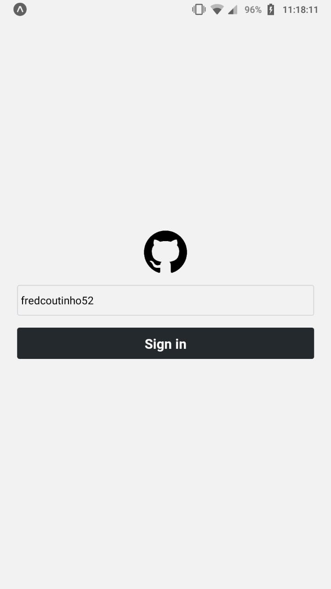
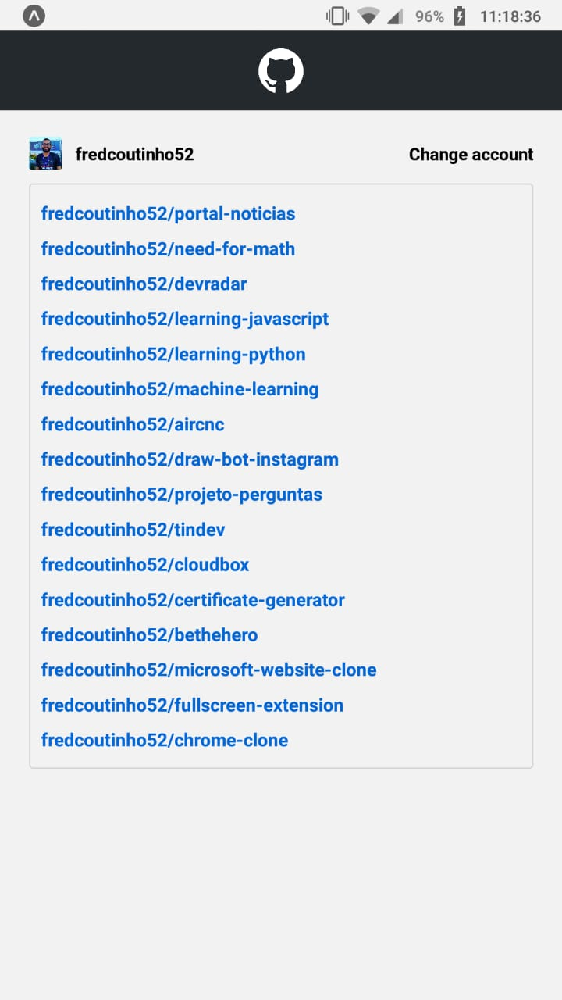

#  GitHub mobile

That's my proposal of a mobile app for GitHub.

## Tools used

* [Axios]()
* [Expo]()
* [GitHud REST API](https://developer.github.com/v3/users/)
* [React Native]()
* [React Navigation]()
* [Visual Studio Code]()

## Screenshots

<center>
<span>


</span>
</center>

## How to use

```bash
# Clone this repository
git clone https://github.com/fredcoutinho52/github-mobile.git

## Install dependencies
npm install

# Run the app
npm start
```
